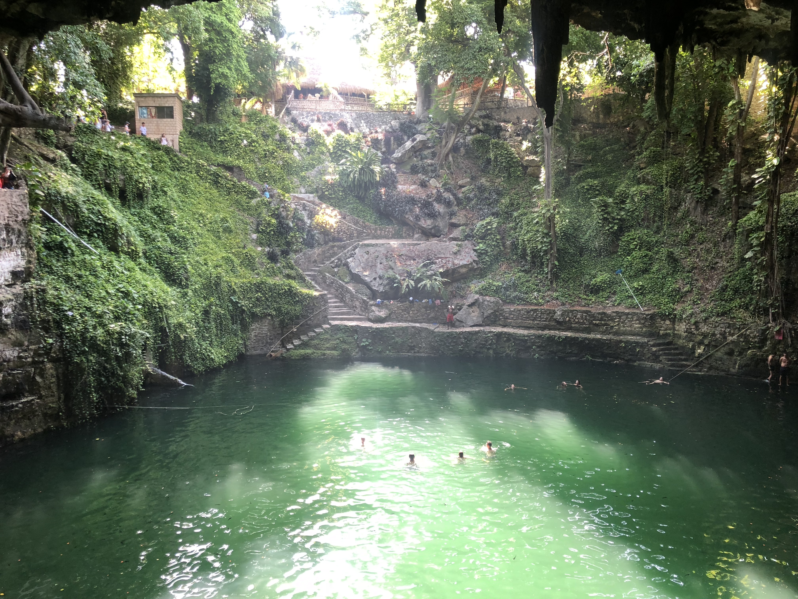

## Erick Cabrera

## Where Are You From?
I am from Cicero, Illinois. It is a suburb about 15 minutes West of downtown Chicago...on a day with light traffic.

## What is your IT interest/specialty?
I have always been a big fan of cybersecurity. Recently, I started to really get into the forensics side of it and have been doing plenty of research on the topic.

## Something Interesting about You
I am a bit of an adrenaline junkie. I have a little bucket list of things I want to do. Some of my most recent completed activities are
diving into a 80m deep cenote, sinkhole, in Mexico (pictured above), base jumped off a mountain, swam 3 miles in a 6m deep river through a cave, and raced a Ferrari on a track. I am looking forward for my trip to Jamaica this upcoming summer where I will be freehiking a mountain and then cliffdiving from it.

## Git tutorial

